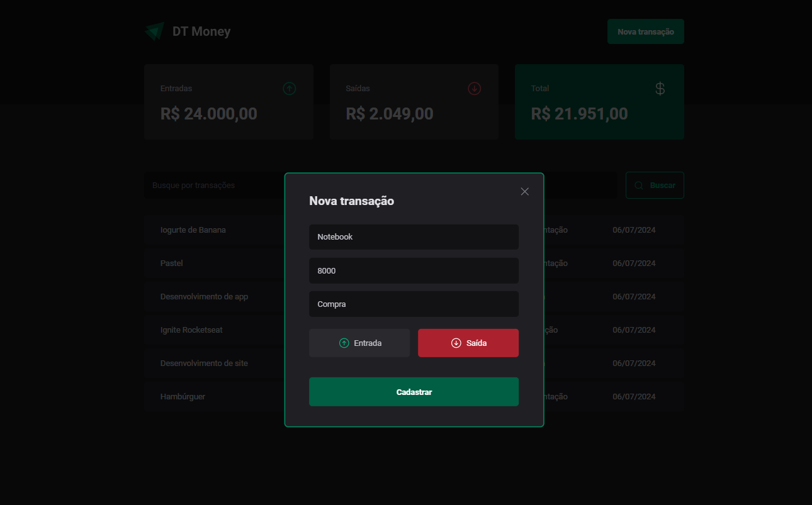

# DT Money

## Descrição

Este projeto foi desenvolvido durante o módulo 03 do curso de ReacjJS da Rocketseat, módulo que aborda como conectar a uma API e como performar aplicações React entendendo como funcionam os algoritmos internos da biblioteca e todo fluxo de renderização de componentes.

### Styled Components

Este projeto utiliza **Styled Components** (https://styled-components.com/) para criar a estilização da aplicação. O Styled Components é uma biblioteca de CSS-in-JS que permite que a gente utilize o CSS dentro do JavaScript e em um formato parecido com os do React, adicionando muitas funcionalidades à estilização da aplicação.

### JSON-server

O **JSON-Server** (https://github.com/typicode/json-server/tree/v0) é uma biblioteca **Node.js** que simula uma API RESTful a partir de um arquivo JSON. Neste projeto, ela é utilizada para a simulação de uma API de transações.

### Axios

**Axios** é um cliente HTTP baseado em Promises para fazer requisições. Pode ser utilizado tanto no navegador quando no Node.js.

### ESList

O **ESLint** é usado neste projeto, pois o mesmo permite que a gente configure diversas regas para padronizar a organização do nosso código. Isso vai desde como deve ser o comportamento de quebras de linha, ponto-e-vírgula, vírgulas e até mesmo regras para nomeação de variáveis ou
plugins que ajudam (https://www.npmjs.com/package/eslint-plugin-react-hooks) a gente à não esquecer algumas regras do React.

O ESLint possui uma enorme lista de rules (regras) que você pode configurar, e todas estão disponíveis através desse link da documentação oficial: https://eslint.org/docs/rules/

Caso queira ver mais sobre como configurar o ESLint manualmente, você pode ver o guia de Getting Started do ESLint disponível no seguinte link: https://eslint.org/docs/user-guide/getting-started

### Forms

A biblioteca **react-hook-form** (https://react-hook-form.com/) é utilizada para recuperar os dados dos inputs dos formulários. Esta biblioteca permite trabalhar-mos com os formulários tanto de uma maneira **Controlled** quanto **Uncontrolled**.

A biblioteca **zod** (https://github.com/colinhacks/zod) é utilizada em conjunto com o react-hook-form pora trazer um pouco mais de integração com o TypeScript (IntelliSense).

Para a integração do react-hook-form com bibliotecas de validação, foi necessário usar a biblioteca **@hookform/resolvers**.

### Radix UI

**Radix UI** é uma biblioteca de componentes para React que se concentra em lógica de interação, deixando a estilização completamente a cargo do desenvolvedor. Ao contrário de outras bibliotecas de componentes que vêm com estilos predefinidos, Radix UI fornece uma base sólida e acessível para a construção de componentes de UI, garantindo que os padrões de acessibilidade sejam atendidos sem sacrificar a flexibilidade de design.

Neste projeto ela é usada para prover o Modal de inserção de novas transações e para disponibilizar um componente Radio customizado e acessível.

## Bibliotecas utilizadas

- [styled-components] (https://www.npmjs.com/package)

```shell
npm i styled-components
```

- [axios] (https://www.npmjs.com/package/axios)

```shell
npm i axios
```

- [phosphor-react] (https://www.npmjs.com/package/phosphor-react)

```shell
npm i phosphor-react
```

- [react-hook-form] (https://www.npmjs.com/package/react-hook-form)

```shell
npm i react-hook-form
```

- [zod] (https://www.npmjs.com/package/zod)
- [@hookform/resolvers] (https://www.npmjs.com/package/@hookform/resolvers)

```shell
npm i zod
npm i @hookform/resolvers
```

### Bibliotecas usadas apenas para desenvolvimento

- [@types/styled-components] (https://www.npmjs.com/package)

```shell
npm i @types/styled-components - D
```

- [eslint] (https://www.npmjs.com/package/eslint)

```shell
npm i eslint -D
```

- [json-server] (https://www.npmjs.com/package/json-server)

```shell
npm i json-server -D
```

- [radix-ui] (https://www.npmjs.com/package/radix-ui)

```shell
npm i @radix-ui/react-dialog
npm i @radix-ui/react-radio-group
```

## Para executar a aplicação

Baixar dependências:

```shell
npm i
```

Executar os comandos:

```shell
npm run dev:server
npm run dev
```

## Telas da aplicação

### Lista de transações


### Modal para adicionar novas transações

#### Exemplo de Entrada


#### Exemplo de Saída


